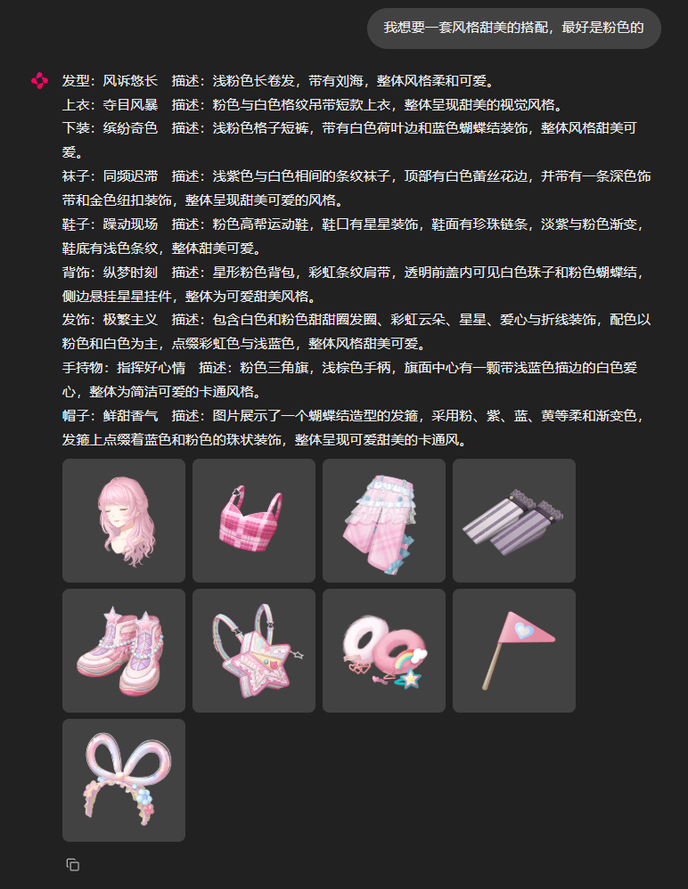
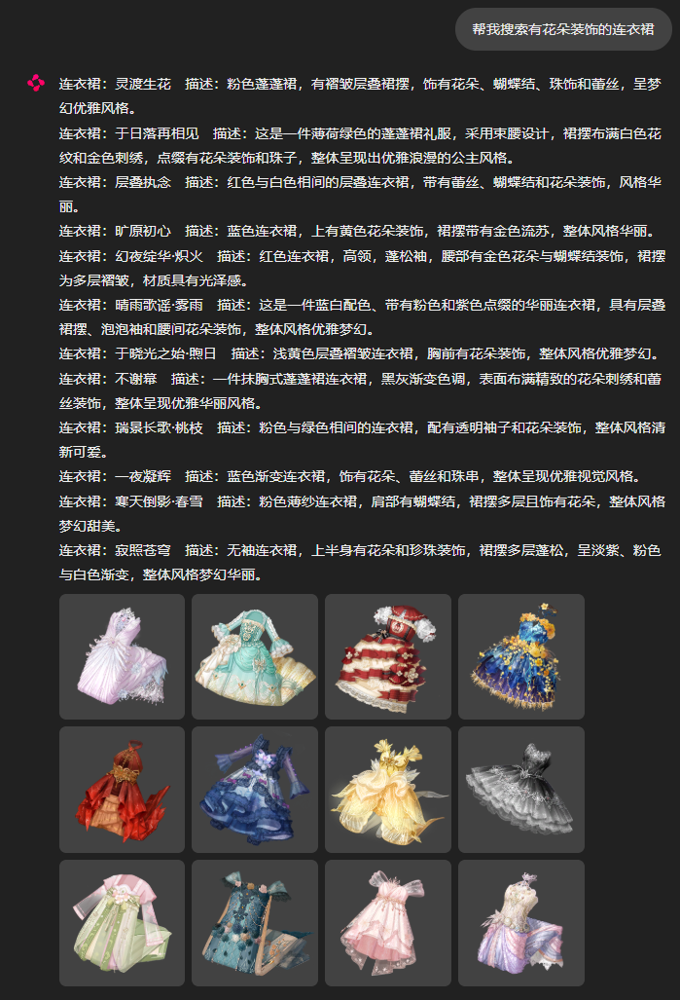
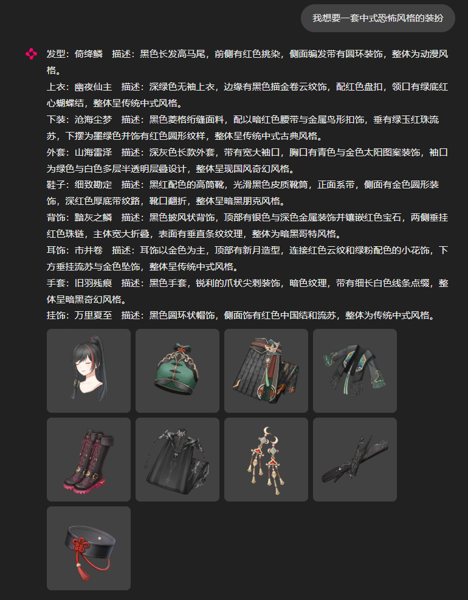
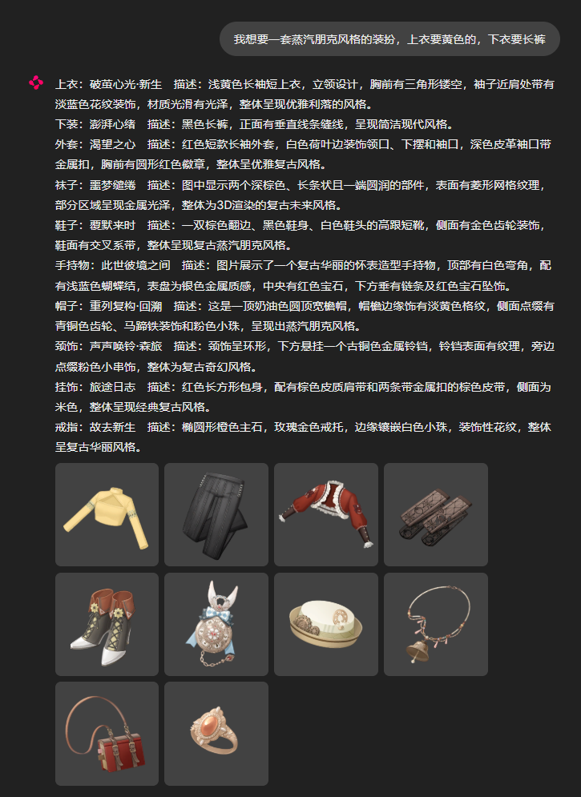

# 无限暖暖搭配推荐Agent

* 这个项目是一个面向无限暖暖的换装搭配agent
* 具体功能是根据用户提出的要求推荐搭配部件。例：输入“给我一套甜美的装扮，最好是粉色的”, agent给出搭配的服装部件的名称和小图。每套搭配至少包括发型、鞋子以及上衣和下装（或者连衣裙）；其他部件分别以 50% 的概率加入搭配。

## 运行示例

### 根据明确关键词推荐搭配

输入“甜美、粉色”等较明确的视觉关键词，Agent 直接结合结构化条件、关键词匹配和向量相似度生成整套搭配。



### 根据描述搜索部件

输入“搜索有花朵装饰的连衣裙”，Agent 判断为部件搜索任务，并返回与描述匹配的连衣裙候选。



### 根据模糊概念推荐搭配

输入“中式恐怖”这类较模糊的概念性要求，Agent 将其转换为可检索的风格和视觉特征，再生成完整搭配。



### 为指定部件设置独立要求

输入整套“蒸汽朋克”风格的共同要求，同时指定上衣为黄色、下装为长裤。Agent 分别检索满足独立条件的部件，再补齐整套搭配。



## 当前版本

目前已经打通以下流程：

```text
用户输入一句自然语言需求
        ↓
Planner 将需求解析为 Plan 和 WardrobeQuery
        ↓
推荐整套搭配、替换当前部件，或搜索指定类别服装
        ↓
WardrobeAgent 更新当前搭配
        ↓
Chainlit 网页输出部件名称和对应小图
```

当前支持在同一个 Agent 会话中维护、修改当前搭配和搜索服装，但不保存完整聊天历史。

Planner 会把颜色、风格和氛围等概括特征直接写入 `keywords`，用于首次大范围召回。当首次结果仍然不足时，Query Expander 会生成 `detail_query` 和 `detail_keywords`；这些信息可以在调试入口中查看。

### 代码结构

```text
agent/
├─ models.py           # Plan、WardrobeQuery、ItemRequest 和推荐结果
├─ message.py          # 单轮输入与回复消息处理
├─ llm_client.py       # DeepSeek 客户端
├─ planner.py          # 生成推荐、替换或搜索的 Plan
├─ query_expander.py   # 在直接召回不足时扩展抽象查询
├─ agent.py            # WardrobeAgent 业务编排
├─ tools/
│  ├─ wardrobe_query_parser.py # WardrobeQuery 合法值读取与校验
│  ├─ recommender.py   # 整套和单品推荐工具
│  ├─ semantic_search.py # 本地文本向量检索
│  ├─ outfit_editor.py # 当前搭配部件替换工具
│  ├─ search.py        # 指定类别服装搜索工具
│  └─ registry.py      # 工具注册器
└─ app.py              # 命令行入口
data_pipeline/
├─ build_database.py        # 校验部件 JSON/图片并全量构建 SQLite
├─ build_text_embeddings.py # 生成部件描述的离线文本向量
└─ README.md                # 数据集构建说明
.chainlit/
└─ config.toml         # Chainlit 页面配置
chainlit_app.py        # Chainlit 正式入口，只展示推荐部件
chainlit_debug_app.py  # Chainlit 调试入口，展示查询解析信息
```

### 安装和配置

建议在项目专用的 Conda 环境中安装依赖：

```powershell
python -m pip install openai python-dotenv chainlit
```

复制 `.env.example` 为 `.env`，填写自己的 DeepSeek API Key：

```text
DEEPSEEK_API_KEY="你的 API Key"
```

程序默认使用 `deepseek-v4-pro`。如需更换模型，可以在 `.env` 中增加：

```text
DEEPSEEK_MODEL="模型名称"
```

文本向量模型下载到项目的 `models/` 目录：

```powershell
hf download Qwen/Qwen3-Embedding-0.6B --local-dir .\models\Qwen3-Embedding-0.6B
```

所有部件描述生成完成后，可以建立离线文本向量：

```powershell
python -m data_pipeline.build_text_embeddings
```

脚本使用本地 `Qwen3-Embedding-0.6B`，将每个 `summary_zh` 转换为归一化的 1024 维向量，并保存到 `data/derived/v1/text_embeddings.npz`。

推荐器读取的数据库位置为：

```text
data/database/dressup.db
```

部件 JSON 和对应图片分别保存在：

```text
data/raw/items/
data/raw/images/
```

可以从这两类原始数据重新构建数据库：

```powershell
python -m data_pipeline.build_database
```

### 运行网页

在项目根目录运行：

```powershell
chainlit run chainlit_app.py
```

Chainlit 会打开本地网页。用户输入一句搭配需求后，页面会返回本次推荐的部件列表和每个部件的图片。图片使用 Chainlit 的小尺寸内嵌显示。开发时如需自动重载代码，可以在命令末尾增加 `-w`。

正式入口只展示每个部件的类别与名称、描述和图片。需要查看结构化查询、概括关键词、细节扩展和部件编号时，运行调试入口：

```powershell
chainlit run chainlit_debug_app.py
```

也可以运行命令行版本：

```powershell
python -m agent.app
```

## 当前算法逻辑

### 1. Planner 与查询解析

`WardrobePlanner` 使用一次 LLM 调用，将用户输入转换为一个只包含单步操作的 `Plan`：

```text
用户自然语言
    ↓
Planner 判断 action，并提取公共 query 和指定部件 item_requests
    ↓
程序校验 JSON 字段、部件类别、星级和数据库合法值
    ↓
WardrobeAgent 调用对应工具
```

Plan 当前支持三种动作：

| `action` | 功能 | `item_type` | `item_requests` |
| --- | --- | --- | --- |
| `recommend_outfit` | 推荐一整套搭配 | `null` | 保存各部件的独立条件 |
| `replace_item` | 替换当前搭配中的一个部件 | 被替换部件的英文类别 | 空数组 |
| `search_items` | 搜索某类部件或指定名称 | 部件类别；按名称搜索时可为 `null` | 空数组 |

整套搭配的共同要求放在顶层 `query` 中；“上衣要红色、下装要绿色”这类只针对特定部件的条件放在 `item_requests` 中。每个 `ItemRequest` 都包含一个部件类别和独立的 `WardrobeQuery`。

`WardrobeQuery` 包含硬筛选条件和模糊描述：

| 字段 | 含义 | 未指定时 |
| --- | --- | --- |
| `main_style` | 主属性 | `None` |
| `quality` | 星级，只允许 3、4、5 | `None` |
| `primary_color` | 主色 | `None` |
| `item_name` | 部件确切名称 | `None` |
| `semantic_query` | 无法归入硬条件的完整描述 | `None` |
| `keywords` | 原始视觉词及模型推断的概括检索词 | `()` |

`WardrobePlanner` 会从 SQLite 读取合法值，并将用户输入解析为 `Plan`。当前 Plan 支持推荐一整套搭配、替换一个部件和搜索指定类别服装，同时包含本轮的 `WardrobeQuery`：

- 星级只有在用户明确提到星级或品质时才填写，“最高品质”解析为 5 星。
- 主属性只有在用户明确指定“主属性”或“属性”时才填写，不会根据“古风、优雅、可爱”等视觉描述推断。
- 主色只有在用户明确提到颜色时才填写。细分颜色会映射为数据库标准色，例如“桃红色”映射为“红色”，同时保留“桃红色”参与语义检索。
- 部件名称只有在用户明确指定确切名称时才填写，并使用 SQLite 精确匹配。
- 其余风格、外观和细节要求保存在 `semantic_query`；`keywords` 保留“珍珠”“双马尾”等直接视觉词，并可根据抽象主题补充颜色、风格和氛围等概括特征。
- 模型推断的概括关键词只参与软检索。例如“中式嫁衣”可以补充“红色、国风、华丽、喜庆”，但不会据此填写 `primary_color` 或 `main_style`。
- 没有指定或没有合适值时返回 `null`，`keywords` 返回空数组。

模型返回后，程序还会检查 JSON 字段、星级范围和数据库合法值，验证通过后才生成 `WardrobeQuery`。

### 2. 部件候选检索

所有整套推荐、单品推荐、替换和搜索最终都复用 `OutfitRecommendationTool.query_items`。检索分为三步：

#### SQLite 硬筛选

程序先根据 `item_type`、`main_style`、`quality`、`primary_color` 和 `item_name` 缩小候选范围。不同硬条件之间使用 `AND`，部件名称使用精确匹配。

#### 关键词匹配

如果存在 `semantic_query`，程序会把 LLM 生成的每个 `keyword` 作为参数，对 `summary_zh` 动态生成 `LIKE` 查询。例如关键词为 `["珍珠", "蝴蝶结"]` 时，逻辑等价于：

```sql
summary_zh LIKE '%珍珠%' OR summary_zh LIKE '%蝴蝶结%'
```

SQL 中没有写死“珍珠”等具体内容；关键词来自本次 Planner 的解析结果。多个关键词之间使用 `OR`，命中任意关键词的部件都会进入候选结果。

#### 文本向量检索

程序同时使用本地 `Qwen3-Embedding-0.6B` 将 `semantic_query` 转成查询向量，在通过硬筛选的候选部件中计算余弦相似度，返回最相近的前 20 个部件。部件的离线向量来自图片描述字段 `summary_zh`，保存在 `data/derived/v1/text_embeddings.npz`。

程序先执行概括关键词和原始语义向量检索。如果直接关键词命中不足，或者初次结果无法组成“发型＋鞋子＋连衣裙或上衣＋下装”的最小搭配，则调用 Query Expander，补充纹样、剪裁、材质和装饰等具体细节。扩展内容只参与软检索，不会改写用户明确指定的硬条件。

最终结果通过 RRF 融合以下有序结果：

```text
原始语义向量检索
+ 概括关键词匹配
+ 细节语义向量检索（触发扩展时）
+ 细节关键词匹配（触发扩展时）
```

RRF 根据各路结果中的排名计算融合顺序，不直接比较关键词分数和向量相似度。有语义要求时，推荐函数选择融合排名最靠前的同类候选；只有硬条件时仍随机选择，以保留结果多样性。当前版本尚未加入相似度阈值和 Rerank。

Chainlit 调试入口会在基础查询的 `keywords` 中显示概括检索词；触发扩展时，再显示本轮使用的 `detail_query` 和 `detail_keywords`。扩展未触发或扩展失败时只显示基础查询。正式入口只展示推荐部件。

如果没有 `semantic_query`，程序只执行 SQLite 硬筛选，不加载向量模型。

### 3. 单个部件推荐

`recommend_item` 调用上述候选检索，并额外限定目标类别。查询指定名称时也可以不提供类别，由数据库中的实际部件类型决定。有语义要求时选择融合排名最靠前的候选，只有硬条件时从候选中随机选择。

### 4. 整套搭配推荐

`recommend_outfit` 本身复用 `recommend_item`：

- 先依次处理 `item_requests`，为每个指定类别调用 `recommend_item`，锁定满足独立条件的部件。
- 如果指定了上衣或下装，主体结构固定为“上衣＋下装”；如果指定了连衣裙，主体结构固定为连衣裙。二者不能同时指定。
- 再使用顶层公共 `query` 补齐发型、鞋子和主体服装，三者属于必选部分。
- 没有指定主体结构时，程序在“上衣＋下装”和“连衣裙”之间随机选择；当前结构无法凑齐时再尝试另一种。
- 每个其他可选类别在检索前独立进行一次 50% 概率判断；未选中的类别不会进入本轮候选检索。用户明确指定的部件不受随机判断影响。
- 如果仍无法组成完整搭配，会返回已有部件，并说明缺少的核心类别。

### 5. 替换与搜索

替换工具复用 `recommend_item`，排除当前搭配中的同类部件后推荐一个新部件，并只替换该类别，其他部件保持不变。

搜索工具复用 `query_items`，返回前 12 条候选结果，不会修改当前搭配。Agent 启动时默认加载“满分出发”套装；如果不存在，则随机生成一套初始搭配。

### 6. 解析示例

以下 JSON 只展示关键字段，程序实际要求每个 `query` 固定包含全部六个字段。

用户输入：`帮我搜索有珍珠装饰的发型`

```json
{
  "action": "search_items",
  "item_type": "hair",
  "query": {
    "semantic_query": "有珍珠装饰",
    "keywords": ["珍珠"]
  }
}
```

用户输入：`请给我一套最高品质、主属性为典雅的搭配`

```json
{
  "action": "recommend_outfit",
  "query": {
    "main_style": "典雅",
    "quality": 5,
    "semantic_query": null,
    "keywords": []
  },
  "item_requests": []
}
```

用户输入：`查询名为芊芊知夏的部件`

```json
{
  "action": "search_items",
  "item_type": null,
  "query": {
    "item_name": "芊芊知夏",
    "semantic_query": null,
    "keywords": []
  }
}
```

用户输入：`我想要一套中式嫁衣风的装扮`

Planner 保留用户表达的原始语义，同时把推断出的颜色、风格和氛围写入软检索关键词，不会写入硬条件：

```json
{
  "action": "recommend_outfit",
  "query": {
    "main_style": null,
    "quality": null,
    "primary_color": null,
    "item_name": null,
    "semantic_query": "中式嫁衣风",
    "keywords": ["中式嫁衣", "红色", "金色", "国风", "华丽", "喜庆"]
  },
  "item_requests": []
}
```

如果这些概括关键词直接命中不足或初次结果无法组成最小搭配，Query Expander 会继续生成类似下面的细节软检索条件：

```json
{
  "detail_query": "中式嫁衣风格，细节包含龙凤刺绣、盘扣、锦缎、秀禾服、龙凤褂或马面裙等传统纹样与剪裁装饰",
  "detail_keywords": ["龙凤纹样", "刺绣", "盘扣", "锦缎", "秀禾服", "龙凤褂", "马面裙"]
}
```

其中“红色”“金色”“国风”“华丽”等概括特征已经由 Planner 写入 `keywords`；Query Expander 只负责补充服装描述中可能出现的具体细节。程序分别执行原始语义、概括关键词、细节语义和细节关键词检索，再通过 RRF 融合各路排名。

用户输入：`帮我搭配一套国风的衣服，其中上衣要桃红色，下衣要柳绿色`

```json
{
  "action": "recommend_outfit",
  "query": {
    "semantic_query": "国风",
    "keywords": ["国风"]
  },
  "item_requests": [
    {
      "item_type": "tops",
      "query": {
        "primary_color": "红色",
        "semantic_query": "国风桃红色",
        "keywords": ["国风", "桃红色"]
      }
    },
    {
      "item_type": "bottoms",
      "query": {
        "primary_color": "绿色",
        "semantic_query": "国风柳绿色",
        "keywords": ["国风", "柳绿色"]
      }
    }
  ]
}
```

这里“红色、绿色”用于 SQLite 硬筛选，“桃红色、柳绿色”继续参与关键词和向量检索。

用户输入：`这个背饰不太搭，换一个童话梦幻一点的`

```json
{
  "action": "replace_item",
  "item_type": "backpieces",
  "query": {
    "semantic_query": "童话梦幻",
    "keywords": ["童话", "梦幻"]
  },
  "item_requests": []
}
```

这一版暂时没有考虑部件之间的色彩协调、风格权重、套装关联、获取方式或用户历史偏好。

## 数据来源与数据库维护

项目内保留了从部件 JSON 和图片构建运行时 SQLite 数据库的数据集流水线；资源抓取仍由外部数据工程负责。更新原始数据后，应保持 JSON 位于 `data/raw/items/`、图片位于 `data/raw/images/`，然后运行 `python -m data_pipeline.build_database` 重新生成 `data/database/dressup.db`。

## 致谢

感谢以下项目为本项目提供的帮助与启发：

* [暖暖共鸣录](https://github.com/dastrokes/gongeo.us-nikki-tracker)
* [暖暖相册](https://github.com/RanAxro/nikki_albums)
