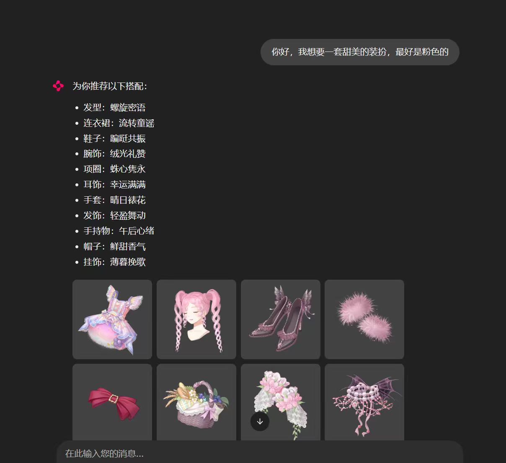

# 无限暖暖搭配推荐Agent

* 这个项目是一个面向无限暖暖的换装搭配agent
* 具体功能是根据用户提出的要求推荐搭配部件。例：输入“给我一套甜美的装扮，最好是粉色的”, agent给出搭配的服装部件的名称和小图。每套搭配至少包括发型、上衣、下衣（或者连衣裙）和鞋子。



## 当前最小版本

目前已经打通以下流程：

```text
用户输入一句自然语言需求
        ↓
Planner 将需求解析为 Plan 和 Intent
        ↓
推荐整套搭配、替换当前部件，或搜索指定类别服装
        ↓
WardrobeAgent 更新当前搭配
        ↓
Chainlit 网页输出部件名称和对应小图
```

当前支持在同一个 Agent 会话中维护、修改当前搭配和搜索服装，但不保存完整聊天历史。

### 代码结构

```text
agent/
├─ models.py           # Intent、服装部件和推荐结果
├─ message.py          # 单轮输入与回复消息处理
├─ llm_client.py       # DeepSeek 客户端
├─ planner.py          # 生成推荐、替换或搜索的 Plan
├─ agent.py            # WardrobeAgent 业务编排
├─ tools/
│  ├─ intent_parser.py # Intent 合法值读取与校验
│  ├─ recommender.py   # 整套和单品推荐工具
│  ├─ outfit_editor.py # 当前搭配部件替换工具
│  ├─ search.py        # 指定类别服装搜索工具
│  └─ registry.py      # 工具注册器
└─ app.py              # 命令行入口
.chainlit/
└─ config.toml         # Chainlit 页面配置
chainlit_app.py        # Chainlit 网页入口
```

### 安装和配置

建议在项目专用的 Conda 环境中安装依赖：

```powershell
python -m pip install openai python-dotenv chainlit
```

复制 `.env.example` 为 `.env`，填写自己的 DeepSeek API Key：

```text
DEEPSEEK_API_KEY="你的 API Key"
```

程序默认使用 `deepseek-v4-pro`。如需更换模型，可以在 `.env` 中增加：

```text
DEEPSEEK_MODEL="模型名称"
```

推荐器读取的数据库位置为：

```text
data/database/dressup.db
```

部件图片保存在 `data/raw/images/`。

### 运行网页

在项目根目录运行：

```powershell
chainlit run chainlit_app.py -w
```

Chainlit 会打开本地网页。用户输入一句搭配需求后，页面会返回本次推荐的部件列表和每个部件的图片。图片使用 Chainlit 的小尺寸内嵌显示。

也可以运行命令行版本：

```powershell
python -m agent.app
```

## 当前算法逻辑

### 1. 计划与意图解析

`Intent` 目前固定包含四个可选字段：

| 字段 | 含义 | 未指定时 |
| --- | --- | --- |
| `main_style` | 主属性 | `None` |
| `quality` | 星级，只允许 3、4、5 | `None` |
| `primary_color` | 主色 | `None` |
| `style_label` | 风格标签 | `None` |

`WardrobePlanner` 会从 SQLite 读取合法值，并将用户输入解析为 `Plan`。当前 Plan 支持推荐一整套搭配、替换一个部件和搜索指定类别服装，同时包含本轮的 `Intent`：

* 星级和颜色只有在用户明确提到时才填写。
* 主属性和风格标签允许根据相近语义选择，例如将“可爱”理解为数据库中的相近主属性。
* 没有指定或没有合适值时返回 `null`。
* 风格标签必须来自数据库，不能由模型自行创造。

模型返回后，程序还会检查 JSON 字段、星级范围和数据库合法值，验证通过后才生成 `Intent`。

### 2. 部件筛选

`OutfitRecommendationTool` 使用 SQLite 精确过滤候选部件。所有已指定条件之间采用 AND 关系，也就是部件必须同时满足全部条件。未指定的字段不参与过滤；星级未指定时仍只考虑 3、4、5 星部件。

当前没有使用向量检索、相似度评分或排序模型，语义理解只发生在生成 `Intent` 的阶段。

### 3. 整套搭配推荐

推荐工具在筛选结果上组成一套搭配：

* 发型和鞋子是必需部件，每类最多选择一个。
* 主体服装可以是“上衣＋下装”，也可以是一件“连衣裙”。
* 程序先随机选择一种主体结构；如果该结构凑不齐，再尝试另一种。
* 外套、袜子和其他分类是可选部件；有候选时，每个分类随机选择一个。
* 同一条件下有多个候选时使用随机选择，使每次推荐尽量不同。
* 如果仍无法组成完整搭配，会说明缺少的核心分类，同时返回当前能够选出的部件。

### 4. 单品推荐与替换

单品推荐复用整套推荐的候选查询，只额外限定目标类别并排除当前部件。替换工具取得新部件后，只更新当前搭配中的同类别部件，其他部件保持不变。Agent 启动时默认加载“满分出发”套装；如果不存在，则随机生成一套初始搭配。

### 5. 服装搜索

搜索工具复用同一个候选查询，根据 `Intent` 和服装类别返回前 12 条结果。搜索只输出服装列表，不会修改当前搭配或当前搭配条件。

这一版属于基于标签的最小规则算法，暂时没有考虑部件之间的色彩协调、风格权重、套装关联、获取方式或用户历史偏好。

## 数据来源与数据库维护

仓库保留推荐程序运行所需的数据库和部件图片，不公开资源抓取与内部数据处理脚本。更新数据后，应保持数据库位于 `data/database/dressup.db`，图片位于 `data/raw/images/`。

## 致谢

感谢以下项目为本项目提供的帮助与启发：

* [暖暖共鸣录](https://github.com/dastrokes/gongeo.us-nikki-tracker)
* [暖暖相册](https://github.com/RanAxro/nikki_albums)
